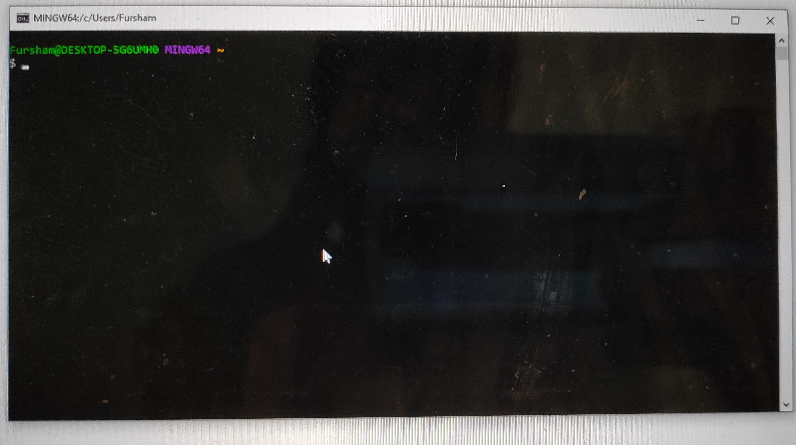

# Setup required for workshop Day 1 {#bashday1}

## Bash Shell
Bash is a commonly-used shell that gives you the power to do simple tasks more quickly.  
Below are the instructions on installing Shell for the 3 main Computer Operating Systems:

#### Windows
[Video Tutorial](https://www.youtube.com/watch?v=339AEqk9c-8)

1. Download the [Git for Windows installer](https://git-scm.com/downloads).
2. Run the installer and follow the steps below:
    1. Click on "Next" four times (two times if you've previously installed Git). You don't need to change anything in the Information, location, components, and start menu screens.
    2. From the dropdown menu select "Use the nano editor by default" and click on "Next".
    3. Click "Next" on the page titled "Adjusting the name of the initial branch...."
    4. Ensure that "Git from the command line and also from 3rd-party software" is selected and click on "Next". (If you don't do this Git Bash will not work properly, requiring you to remove the Git Bash installation, re-run the installer and to select the "Git from the command line and also from 3rd-party software" option.)
    5. Ensure that "Use the native Windows Secure Channel library" is selected and click on "Next".
    6. Ensure that "Checkout Windows-style, commit Unix-style line endings" is selected and click on "Next".
    7. Ensure that "Use Windows' default console window" is selected and click on "Next".
    8. Click "Next" for the next 2 menu page.
    9. Ensure that "Enable file system caching" and "Enable Git Credential Manager" are selected and click on "Next".
    10. Click "Next" on the menu page titled "Configuring experimental options".
    11. Click on "Install".
    12. Click on "Finish".
3. If your "HOME" environment variable is not set (or you don't know what this is):
    1. Open command prompt (Open Start Menu then type cmd and press [Enter])
    2. Type the following line into the command prompt window exactly as shown:
        `setx HOME "%USERPROFILE%"`
    3. Press [Enter], you should see SUCCESS: Specified value was saved.
    4. Quit command prompt by typing exit then pressing [Enter]

To open the Bash Shell, type "Git Bash" on the search toolbar at the bottom 
of your screen and press enter. This should open a window as shown below.
```{r echo=FALSE}

```


#### MacOS
The default shell in some versions of macOS is Bash, and Bash is available in 
all versions, so no need to install anything. You access Bash from the Terminal 
(found in `/Applications/Utilities`). To open Terminal, press Command-Spacebar 
to open Spotlight search and type "Terminal". You may want to keep Terminal in your 
dock for this workshop.

To see if your default shell is Bash type `echo $SHELL` in Terminal and press 
the enter/return key. If the message printed does not end with '/bash' then 
your default is something else and you can run Bash by typing `bash`.


#### Linux
The default shell is usually Bash and there is usually no need to install anything.

To see if your default shell is Bash type `echo $SHELL` in Terminal and press 
the enter/return key. If the message printed does not end with '/bash' then 
your default is something else and you can run Bash by typing `bash`.

# Setup required for workshop Day 2 {#bashday2}

## Software to process RNAseq data

|Software|Version|Manual|Available for|Description|
|:---|:------------|:------------|:------------|:------------|
|[FastQC](https://www.bioinformatics.babraham.ac.uk/projects/fastqc/)|0.11.9|[Link](https://www.bioinformatics.babraham.ac.uk/projects/fastqc/Help/)|Linux, MacOS, Windows|Quality control tool for high throughput sequence data.|
|[Trimmomatic](http://www.usadellab.org/cms/?page=trimmomatic)|0.39|[Link](http://www.usadellab.org/cms/uploads/supplementary/Trimmomatic/TrimmomaticManual_V0.32.pdf)|Linux, MacOS, Windows|A flexible read trimming tool for Illumina NGS data.|
|[Kallisto](https://pachterlab.github.io/kallisto/)|0.46.1|[Link](https://pachterlab.github.io/kallisto/manual)|Linux, MacOS, Windows|Quantifying abundances of transcripts from bulk and single-cell RNA-Seq data.|

## How to install the above software

Here, we provide two ways to install the above software; [(1) using miniconda package
manger](#miniconda) or [(2) installing binaries from command-line](#bin).

### Installing via miniconda {#miniconda}
The easiest way to download these software is using miniconda. 
Miniconda is a package manager that simplifies the installation process. 
Please first install miniconda3 (installation instructions below), and then 
proceed to the installation of individual tools.  

For users having issues installing miniconda3 or other softwares using miniconda3
package manager, please refer to the [alternative method](#bin) below.

<br/> 

#### Miniconda3
Miniconda3 is available on Windows, MacOS and Linux operating systems.  
Please download Miniconda3 64-bit (Python 3.9) from the this 
[website](https://docs.conda.io/en/latest/miniconda.html) 
and follow the instructions below. (For MacOSX users, choose Miniconda3 MacOSX 64-bit pkg).

1. Open the installer.
2. Click "Next" to begin installation process.
3. Click "I Agree".
4. Select "Just Me" and click "Next".
5. Click "Next" to install to default destination.
6. **Important: Select both Add Miniconda3 to my PATH environment variable and Register 
Miniconda3 as my default Python 3.9**. Click "Install".
7. Click on "Finish"

To check if miniconda3 is successfully installed, open Terminal (MacOS) or 
Git Bash (Windows) and type `conda`. This should print out a list of conda
functions and instructions.

<br/>

#### FastQC
To install, open Terminal (MacOS) or 
Git Bash (Windows) and type the following in the console:

```
conda install -c bioconda fastqc
```

You may test your installion by running:
```
fastqc -h
```

<br/>

#### Trimmomatic
Open Terminal (MacOS) or 
Git Bash (Windows) and type the following in the console:

```
conda install -c bioconda trimmomatic
```

You may test your installion by running:
```
trimmomatic
```

<br/>

#### Kallisto
Open Terminal (MacOS) or 
Git Bash (Windows) and type the following in the console:

```
conda install -c bioconda kallisto
```

You may test your installion by running:
```
kallisto
```
<br/>

### Installing binaries using command-line {#bin}
To install the above programs using this alternative method, follow these
set of instructions **carefully**:  

1. Open Terminal (MacOS) or Git Bash (Windows) and type the following in the console:
```
cd ~
mkdir -p src
mkdir -p bin
```
2. Check if you have Java installed by typing:
```
java -version
```
If you don't see something like this,
```
>java -version
openjdk version "11.0.2" 2019-01-15
OpenJDK Runtime Environment AdoptOpenJDK (build 11.0.2+9)
OpenJDK 64-Bit Server VM AdoptOpenJDK (build 11.0.2+9, mixed mode)
```
you will need to install java first from this [website](https://adoptopenjdk.net/)  

3. Install FastQC by typing the following in Terminal (MacOS) or 
Git Bash (Windows):
```
curl -O https://www.bioinformatics.babraham.ac.uk/projects/fastqc/fastqc_v0.11.9.zip
unzip fastqc_v0.11.9.zip -d src
cp -r src/FastQC/* bin
```
4. Install Trimmomatic by typing the following in Terminal (MacOS) or 
Git Bash (Windows):
```
curl -O http://www.usadellab.org/cms/uploads/supplementary/Trimmomatic/Trimmomatic-0.39.zip
unzip Trimmomatic-0.39.zip -d src
echo '#!/bin/bash' > ~/bin/trimmomatic
echo 'java -jar ~/src/Trimmomatic-0.39/trimmomatic-0.39.jar $@' >> ~/bin/trimmomatic
chmod +x ~/bin/trimmomatic
```
5. Install Kallisto by typing the following in Terminal (MacOS) or 
Git Bash (Windows):
```
# for mac
curl -O https://github.com/pachterlab/kallisto/releases/download/v0.46.1/kallisto_mac-v0.46.1.tar.gz
tar -zxvf kallisto_mac-v0.46.1.tar.gz -C src
cp src/kallisto/kallisto bin

# for windows
curl -O https://github.com/pachterlab/kallisto/releases/download/v0.46.1/kallisto_windows-v0.46.1.zip
unzip kallisto_windows-v0.46.1.zip -d src
cp src/kallisto/kallisto.exe bin

```

<br/>
<br/>


