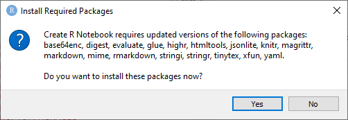

Text can be written anywhere within the document. 
Text written on a new line will not be rendered as a new paragraph.

To create a new paragraph, leave a linespace from the previous sentence.

Headers and sub-headers can be created using the `#` symbol. The depth of the sub-headers
depend on the number of `#` symbol; 1 symbol represents the top-most layer.

# Formatting text in Markdown format

## Create bullet points

Bullets points can be created as such:

- Point 1
- Point 2 

Substituting hyphen with a number will create numbered bullet points:

1. Point 1
2. Point 2

## Formatting text

There are several ways to make standard types of formatted text:

- *italics*
- **bold**
- `code`
- [weblinks](https://www.google.com/)

## Adding in-line image

You can add an image into text using the following syntax:



# Writing code in RNotebook

The simplest way to write code is using the ` symbol. You have to specify
the language to be interpreted. For example:

`r 1+1`

A better way is to write your code in "chunks". To create code chunks,
click the `+C` button at the top of this document, and select your language:

```{r writingcode}
1+1
```

You may configure the output of each chunk.

The example below will only return the value
```{r confoutput, echo=FALSE}
1+1
```

The example below will only run the code, but will not output anything
```{r loadtidyverse, include=FALSE}
# install.packages(tidyverse)
library(tidyverse)
```

# Create interactive tables from data-frame/matrix

You can display data-frames or matrices as tables
natively by printing the table out within a code-chunk

```{r}
mtcars
```

The table above is static. This can be made interactive using the DT package.


```{r}
library(DT)
datatable(mtcars)
```

Bonus: you may apply add-ons to your table to allow filtering and exporting of data


```{r}
datatable(mtcars, extensions = "Buttons", options = list(dom = "Blfrtip",
                           buttons = c("copy", "csv", "excel"),
                           scrollX = TRUE), filter = "top")
```

# Create interactive plots

Create basic plots the same way as you normally do within a code chunk.

```{r}
ggplot(mtcars, aes(x=mpg, y = disp)) + geom_point()
```


Change figure dimensions. Add captions


```{r include=FALSE}
library(plotly)
```

```{r}
plot <- ggplot(mtcars, aes(x=mpg, y = disp)) + geom_point()
ggplotly(plot)
```


# Links to resources

- Different HTML document themes: https://www.datadreaming.org/post/r-markdown-theme-gallery/
- Markdown CheatSheet: https://www.markdownguide.org/cheat-sheet/


