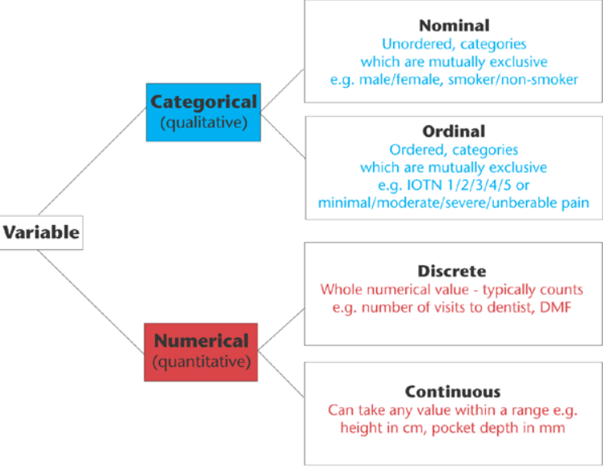

```{r setup, include=F}
knitr::opts_chunk$set(echo = TRUE, message = F, warning = F, fig.align = "center")
```


R provides a wide array of functions to help you with statistical analyses. In this lesson, we will
learn how to differentiate the various types of variables and how to formulate your null hypothesis. 
We will then perform statistical comparisons of numerical variables 
between one-, two- and multiple-samples using parametric and nonparametric tests. We will also
perform test of independence for categorical variables and correlation tests between two variables.

Before we begin, please make sure you have these packages installed and loaded onto your environment.
```{r}
library(tidyverse)
library(gapminder)
```

# Understand your variables.

## Type of variables

Essentially, there are 4 major types of variables:

1. Nominal
2. Ordinal
3. Discrete
4. Continuous

The first two variables are categorical (qualitative) and the latter two are
numerical (quantitative). The difference between ordinal variables and 
nominal variables is that the former have an implied order (low to high). 
Discrete variables are usually integers and that it take up certain values
along an interval. Continuous variables on the other hand can take up any
value along an interval, thus it can usually be represented as decimals (floats).
See Figure \@ref(fig:variables) for an illustration. 

<br/>
```{r variables, echo = F, fig.cap="Different types of variables and examples"}

```
<br/>
Some statistical tests make assumptions on the distribution of your
continuous variables. Usually, it assumes that your data is
normally distributed and that its mean is representative of the 
population means. In the section below, we will show ways to test
your variables for normality.  

### Exercise 1
Determine the type of variables from the `gapminder` dataset.

<details>
  <summary>Click here for Answer!</summary>
  You may summarise the variables from a dataset using the `summary()` 
  function. 
```{r}
summary(gapminder)
```

1. country: Nominal
2. continent: Nominal
3. year: Discrete
4. lifeExp: Continuous
5. pop: Discrete
6. gdpPercap: Continous

</details> 

### Exercise 2
Plot the distribution of lifeExp and population for each continent.
You may use your geometry of choice. 

<details>
  <summary>Click here for Answer!</summary>
```{r}
gapminder %>% 
    ggplot(aes(x=continent, y=lifeExp, fill = continent)) +
    geom_boxplot()
gapminder %>% 
    ggplot(aes(x=continent, y=pop, fill = continent)) +
    geom_boxplot()
```


</details> 


## Descriptive statistics

R comes pre-built with functions designed to provide a range of
descriptive statistics. The most common function is `summary()`.
This function analyzes each variable in a given dataframe and
summarises it. For numerical variables, it describes the minimum
maximum values, the 25th and 75th percentile values as well as
mean and median. For categorical variables, it lists the counts
for each category. 

```{r}
summary(gapminder)
```

The above function summarises data from the entire variable. At times, you
may wish to group values based on a particular categorical variable (say continent)
and output its descriptive statistics. To perform this, we will use `Tidyverse` package
to group and summarise the mean and standard deviation of `lifeExp` variable:

```{r}
gapminder %>% 
    group_by(continent) %>% 
    summarise(mean_lifeExp = mean(lifeExp),
              sd_lifeExp = sd(lifeExp))
```

You would need to create new columns for each descriptive summary.

### Exercise 3
Summarise the mean, median, and variance of `gdpPercap` for each of these 
countries: UK, US and India.

<details>
  <summary>Click here for Answer!</summary>
```{r}
gapminder %>% 
    filter(country %in% c("United Kingdom", "United States", "India")) %>% 
    group_by(country) %>% 
    summarise(mean_gdpPercap = mean(gdpPercap),
              median_gdpPercap = median(gdpPercap),
              var_gdpPercap = var(gdpPercap))
```

</details> 

## Test continuous variables for normality

There are qualitative and quantitative ways to test for normality of a 
continuous data. Let us determine the normality of life expectancy
for residents of the UK.

The qualitative way is to plot the distribution of the variable and
observe the data for a normal distribution:
```{r}
UK.dat<- gapminder[gapminder$country == "United Kingdom",]
UK.dat %>% 
    ggplot(aes(x=gdpPercap)) +
    geom_boxplot()
```


```{r}
UK.lifeExp<- UK.dat$lifeExp
shapiro.test(UK.lifeExp)
```


```{r}
gapminder %>% 
    group_by(country) %>% 
    summarise(shapiro.length = shapiro.test(lifeExp)$p.value,
              shapiro.branches = shapiro.test(gdpPercap)$p.value) %>% 
    arrange(desc(shapiro.length))
```


