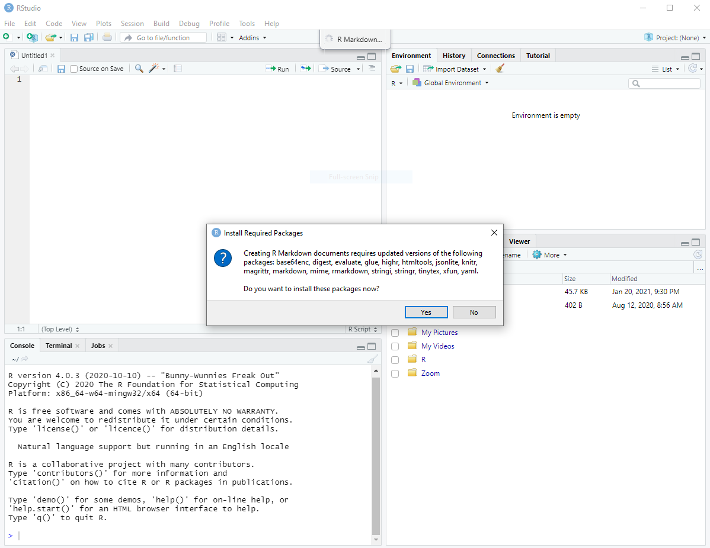
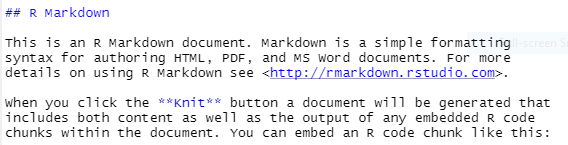

> ### Overview
>
Teaching: x mins  
Exercises: x mins    
>
**Objectives**:  
>
> 1) Familiarize with RStudio layout
> 2) Create reports using R Notebook
>
>

## Before Starting the Lesson
To facilitate the timeliness of the lesson, please ensure that you have these 
programs installed on your computer.

* [Latest version of R](https://www.r-project.org/)
* [Latest version of RStudio](https://www.rstudio.com/)
* Other softwares here <----

## Introduction to RStudio
Welcome to the first lesson of ______.  

In this lesson, we will go through some of the basics of the R language for
data analysis as well as share some common practices in documenting reports.  

We’ll be using RStudio: a free, open source R Integrated Development 
Environment (IDE). It provides a built in editor, works on all platforms 
(including on servers) and provides many advantages such as integration with 
version control and project management.

### RStudio layout
When you first open RStudio, you will be greeted by three panels:

* The interactive R console/Terminal (entire left)
* Environment/History/Connections (tabbed in upper right)
* Files/Plots/Packages/Help/Viewer (tabbed in lower right  
<br />
<!-- Add image of RStudio upon loading-->
```{r RStudio_load_image, fig.cap= "Figure 1: RStudio layout", echo =FALSE, fig.align='center',out.width="80%"}
knitr::include_graphics("./RStudio_upon_load.PNG")
```
<br /><br />

Once you open files, such as R scripts, an editor panel will also open in the top left.
<br />
<!-- Add image of RStudio with a script -->
```{r RStudio_load_image2, fig.cap= "Figure 2: RStudio layout with editor", echo =FALSE, fig.align='center',out.width="80%"}
knitr::include_graphics("./RStudio_with_editor.PNG")
```
<br /><br />


### Work flow within RStudio
There are two main ways one can work within RStudio:

1) Test and play within the interactive R console then copy code into a .R file 
to run later.

    * This works well when doing small tests and initially starting off.
    * It quickly becomes laborious


2) Start writing in a .R file and use RStudio’s short cut keys for the Run 
command to push the current line, selected lines or modified lines to the 
interactive R console.

    * This is a great way to start; all your code is saved for later
    * You will be able to run the file you create from within RStudio or using R’s source() function.

3) Simultaneously write and document your code in an R Markdown file and use Knit to
render the document to HTML or PDF.

    * A good practice to adopt right from the start
    * Output file contain publication-grade documentations and is easily shareable
    
## Using R Markdown
R Markdown is a file format for making dynamic documents with R. This file 
document is written in markdown (an easy-to-write plain text format) and 
contains chunks of embedded R code.  

### Creating your first R Markdown
To create your own R Markdown document, click 
File → New File → R Markdown. If this is your first time using RStudio, you 
will be prompted to install dependencies. Click **Yes**.

<br />
```{r RStudio_Rmkardown_install, fig.cap= "Figure 3: Prompt to install RMarkdown dependencies", echo =FALSE, fig.align='center',out.width="80%"}

```
<br /><br />

Once packages are successfully installed, you’ll get a dialog box like this:  
<br />
<!-- Add image of creating R Markdown -->
```{r RStudio_Rmarkdown_start, fig.cap= "Figure 4: Dialog box with RMarkdown document options", echo =FALSE, fig.align='center',out.width="80%"}
knitr::include_graphics("./RStudio_upon_RMarkdown_load2.PNG")
```
<br /><br />
You may choose HTML as the default output format, but this can be changed later.  

A template R Markdown document will appear in the editor pane (top left corner).

### Basic components of an R Markdown
There are three basic components of an R Markdown document: the metadata, text, and code.  

The metadata usually sits at the top of the document and is written between the 
pair of three dashes `---`. This section contains information that can affect 
the code, content, and the rendering process. The content is written in YAML
and you may refer to this [guide](https://cran.r-project.org/web/packages/ymlthis/vignettes/yaml-fieldguide.html)
for detailed description of its syntax.  
<!-- Add image of YAML header -->
<br />
```{r RStudio_Rmarkdown_header, fig.cap= "Figure 5: Default RMarkdown metadata header", echo =FALSE, fig.align='center', out.width="80%"}
knitr::include_graphics("./RStudio_RMarkdown_header.PNG")
```
<br /><br />

Text can be written anywhere underneath the metadata header and will be rendered
as the body of the document. To format text as headers, you may prefix the sentence
with a hash (#) symbol. For details on Markdown formatting options, refer to  this 
[CheatSheet](https://github.com/adam-p/markdown-here/wiki/Markdown-Cheatsheet).  
<br />
```{r RStudio_Rmarkdown_text, fig.cap= "Figure 6: Text portion of an RMarkdown file", echo =FALSE, fig.align='center', out.width="80%"}

```
<br /><br />

Finally, code can be written and executed within so-called **Chunks** bounded
by  ```` ```{r}````  and ```` ``` ````. There are a lot of things you can do in 
a code chunk: you can produce text output, tables, or graphics. You have fine 
control over all these output via chunk options, which can be provided inside 
the curly braces between ````{r```` and ````}````. Detailed information on 
chunk options can be found [here](https://bookdown.org/yihui./Rmarkdown./R-code.html).  
<br />
```{r RStudio_Rmarkdown_chunk, fig.cap= "Figure 7: Code chunks within RMarkdown", echo =FALSE, fig.align='center', out.width="80%"}
knitr::include_graphics("./RStudio_RMarkdown_chunk.PNG")
```
<br /><br />

There are several ways to execute code within a chunk. The most straight-forward
method is to click on the green arrow button (). This sends the 
entire code chunk to console for execution. Yet another way is to run specific code
within a chunk. This can be done by either highlighting the desired code or placing
the *text cursor* within a code, and then pressing `Ctrl + Enter` 
(or `Command + Enter` for Mac).  

### Formatting contents of R Markdown
Include hyperlinks to formatting

### Rendering your document to PDF


Exercise:


An R Notebook is an implementation of [Literate Programming](https://en.wikipedia.org/wiki/Literate_programming)
that allows direct coding within R while producing a reproducible document
with publication-grade output. 


